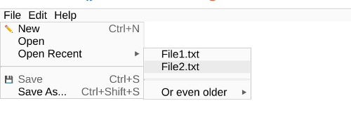

# jdmenubar Javascript Desktop Menu Bar


A Javascript / CSS library for building a desktop look-a-like
menu bar. 



# Examples

* [Standard example](https://midstar.github.io/jdmenubar/example.html) and 
  [source](https://github.com/midstar/jdmenubar/blob/main/example.html)
* [Customized example](https://midstar.github.io/jdmenubar/example_customized.html) and 
  [source](https://github.com/midstar/jdmenubar/blob/main/example_customized.html)

# Installation

Download jdmenubar.js and jdmenubar.css and include in your HTML or use
following lines in your HTML code:

```html
<link rel="stylesheet" href="https://cdn.jsdelivr.net/gh/midstar/jdmenubar/jdmenubar.min.css" type="text/css">
<script src="https://cdn.jsdelivr.net/gh/midstar/jdmenubar/jdmenubar.min.js"></script>
```

# Usage

This library consists of the MenuBar object and a css for the design.

The MenuBar object requires the HTML object (typically a DIV element)
and an array of so called menuItem's. The menuItem's represents each
element in the menu and its properties. 

Each menuItem object may have following properties:

| Property name | Mandatory | Description                                                                                         |
|---------------|-----------|-----------------------------------------------------------------------------------------------------|
| text          | Yes       | The "title" of the menuItem.                                                                        |
| id            | No        | Identity of item. Only needed if getItemWithId() method will be used for update.                    |
| handler       | No        | Function (callback) to execute when menuItem is selected.                                           |
| subMenuItems  | No        | An array of menuItem's for a sub menu. Cannot be combined with handler property.                    |
| icon          | No        | Left side symbol. Can be text symbol or IMG element. Not allowed for first level of menuItem's.     |
| shortcut      | No        | Right side text describing the short cut for this action. Not allowed for first level of menuItem's |
| enabled       | No        | Default true. Set to false to disable (gray out) the menuItem.                                      |

A special type of menuItem is the separator which can only be used in a
sub menu and not in the "top menu". The separator shall only have one
property, separator, which shall be to true.

The list of menuItems might be updated after the menu bar has been
generated, but to make the changes have effect the update() method
in the MenuBar object needs to be called.

To simplify update of individual menuItems each menuItem can be
given an identity (with the id property) and be fetched and updated
with the getItemWithId() method.

# How to customize the look-and-feel

The jdmenubar.css style sheet includes a number of variables to 
customize colors and sizes. See the customized example
[source](https://github.com/midstar/jdmenubar/blob/main/example_customized.html).
